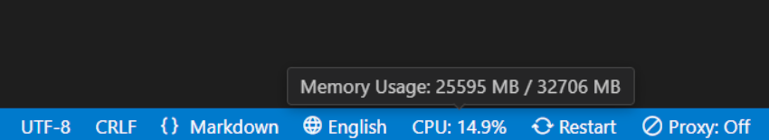

<p align="center">
  <h1 align="center">otak-monitor</h1>
  <p align="center">A lightweight system monitor for VS Code - Track CPU, memory, and disk usage with efficient 5-second updates and 1-minute averages.</p>
</p>

---

## Usage



1. Find the system monitor in your VS Code status bar
2. View CPU usage percentage
3. Hover to see detailed current and average metrics

## Features

otak-monitor is a lightweight VS Code extension that helps you monitor system resources without leaving your editor.

### Key Features

- **CPU Monitoring**:
  - Status bar display of CPU usage percentage
  - Updates every 5 seconds
  - Aggregated across all CPU cores
  - Precise to one decimal place
  - Current CPU clock speed (MHz)
  - 1-minute moving average

- **Memory Usage Tracking**:
  - Detailed memory information
  - Shows used and total memory in MB
  - Memory usage percentage
  - 1-minute moving average
  - Regular updates

- **Disk Usage Monitoring**:
  - Cross-platform disk space monitoring
    - Windows: C: drive (home directory in Codespaces)
    - macOS: Root volume (/)
    - Linux: Root filesystem (workspace root in Codespaces)
  - Shows used and total space in GB
  - Disk usage percentage
  - 1-minute moving average

- **Visual Integration**:
  - Clean status bar integration
  - Right-aligned placement
  - Non-intrusive display
  - Detailed hover tooltip showing:
    - Current CPU, memory, and disk metrics
    - 1-minute average values
    - Regular 5-second updates

## Requirements

- Visual Studio Code ^1.90.0
- Supported environments:
  - Local: Windows, macOS, Linux
  - Remote: GitHub Codespaces

## Installation

1. Install the extension from VS Code Marketplace
2. Look for the CPU usage display in your status bar
3. Hover over it to see detailed system information

## Status Bar Display

The extension shows the following information in your status bar:

```
CPU: 45.3%  // CPU usage
```

With a detailed tooltip showing:
```
Current:
CPU Usage: 45.3% (2400 MHz)
Memory Usage: 1024 MB / 2048 MB (50.0%)
Disk Usage: 150 GB / 500 GB (30.0%)
```

Note: For disk usage, the monitored path varies by environment:
- Windows:
  - Local: C: drive
  - Codespaces: Home directory
- macOS: Root volume (/)
- Linux:
  - Local: Root filesystem (/)
  - Codespaces: Workspace root

## Implementation Details

- CPU usage is calculated by comparing idle and total CPU time differences
- Memory values are shown in MB and percentage
- Disk usage monitoring adapts to the environment:
  - Local machines: Monitors system root or C: drive
  - Codespaces: Monitors relevant workspace paths
- Moving averages are calculated using 12 data points (5-second intervals over 1 minute)
- Updates occur every 5 seconds for efficient monitoring
- Minimal performance impact on the system

## GitHub Codespaces Support

The extension automatically detects when running in GitHub Codespaces and adjusts its behavior:
- Monitors the workspace root directory in Linux environments
- Uses home directory for Windows-based Codespaces
- Maintains consistent monitoring experience across all environments
- Provides accurate disk usage information for containerized development

## Contributing

Contributions are welcome! Please feel free to submit a Pull Request. For major changes, please open an issue first to discuss what you would like to change.

## License

This project is licensed under the MIT License - see the [LICENSE](LICENSE) file for details.

---

For more information, visit the [GitHub repository](https://github.com/tsuyoshi-otake-system-exe-jp/otak-monitor).
