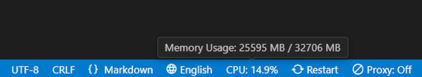

<div align="center">

# otak-monitor

**Watch CPU, memory, and disk usage without leaving VS Code.**

otak-monitor keeps a lightweight CPU indicator in your status bar, shows current system metrics on hover, and copies a Markdown snapshot when you click it.

[](https://marketplace.visualstudio.com/items?itemName=odangoo.otak-monitor)
[](https://code.visualstudio.com/)
[](LICENSE)
[](https://github.com/tsuyoshi-otake/otak-monitor)


[**Install**](https://marketplace.visualstudio.com/items?itemName=odangoo.otak-monitor) ·
[**GitHub**](https://github.com/tsuyoshi-otake/otak-monitor) ·
[**Report an issue**](https://github.com/tsuyoshi-otake/otak-monitor/issues)

</div>

---

Development often means checking whether your editor, build, tests, containers, or browser are consuming the machine. **otak-monitor keeps the essential CPU, memory, and disk numbers inside VS Code** so you can glance at the status bar, inspect details on hover, and paste a formatted snapshot into notes or issues.

## Quick Start

1. **Install** from the [VS Code Marketplace](https://marketplace.visualstudio.com/items?itemName=odangoo.otak-monitor).
2. Reload or start VS Code.
3. Find the CPU indicator on the right side of the status bar.
4. Hover to inspect CPU, memory, and disk usage.
5. Click the status bar item to copy a Markdown metrics snapshot.



## Capabilities

- **Status bar CPU monitor**: shows current CPU usage in a stable-width `CPU: 05%` format.
- **Current system tooltip**: hover for CPU usage and clock speed, memory usage, disk usage, and the size of the open folder.
- **Markdown clipboard snapshot**: click once to copy current metrics and 1-minute averages.
- **Rolling averages**: keeps a fixed-size history of 24 samples for CPU, memory, and disk averages.
- **Efficient refresh cadence**: updates every 2.5 seconds while the VS Code window is focused, every 5 seconds while unfocused, and every 10 seconds while unfocused and following another window.
- **One sample per machine**: with several windows open, one of them is elected to do the sampling and the others render what it publishes, so the cost does not grow with the number of windows.
- **Incremental folder measurement**: remembers the total under each expensive subtree and re-measures only the part that changed, so editing one file costs a few filesystem requests instead of a full walk.
- **Non-blocking folder measurement**: the folder size is measured in the background, so a large workspace never delays a status bar update.
- **Scanner-friendly walking**: measures with directory listings and file attributes only, never opening a file, and keeps a fixed cap on requests in flight.
- **Cached disk sampling**: avoids repeated synchronous disk checks by caching disk stats between samples.
- **Quiet redraws**: the status bar and tooltip are only reassigned when the text they would show has actually changed.
- **Cross-platform paths**: monitors the right root path on Windows, macOS, Linux, and GitHub Codespaces.
- **Local-only operation**: no accounts, API keys, telemetry, or network calls are required for monitoring.

## How It Works

When VS Code finishes startup, otak-monitor:

1. Creates a right-aligned status bar item.
2. Samples aggregate CPU usage from OS CPU time deltas.
3. Reads memory usage from the operating system.
4. Samples disk usage with a platform-aware monitor path.
5. Measures the size of the open folder in the background.
6. Adds each sample to a fixed-size rolling history.
7. Updates the status bar text and hover tooltip.

Clicking the status bar item refreshes disk usage, writes a Markdown report to the clipboard, and shows a short confirmation message.

### Several Windows Open

CPU, memory, and disk usage read the same in every window, and measuring the size of a folder gives the same answer to every window that opened it — so otak-monitor only pays for them once.

The windows share a small lease file in the extension's storage directory. One window holds it, does the sampling, and publishes the result; the others read that result instead of sampling. The lease is renewed on a heartbeat, so closing or killing the sampling window lets another one take over within about half a minute. Windows that opened different folders keep separate leases for the folder size, since that measurement is not shared between them.

A window that is following another one reads CPU, memory, and disk usage from the published result and never walks the folder itself; the size simply appears once the measuring window publishes it. So opening a second window on the same folder adds no filesystem work at all.

If the storage directory cannot be written to, each window simply samples for itself.

### Measuring the Folder Size

Walking a real workspace is tens of thousands of filesystem requests, and almost nothing changes between two updates — so otak-monitor measures the difference rather than the whole folder.

While walking, it remembers the total under each subtree that was expensive to reach. When a file changes, only the subtrees containing that file are measured again; every other total is answered from memory without touching the disk. Which subtrees are remembered is decided by what they cost to walk rather than by how deep they are, so it fits the shape of the project on its own: a repository with a large `node_modules` beside a small `src` remembers `node_modules`, while a monorepo with everything under `packages/` remembers each package. The number of remembered totals is capped, so this costs a fixed amount of memory rather than one that grows with the tree.

Measured on this repository (5.4 GB, 9,171 directories, 51,305 files):

| | Time |
|---|---|
| First measurement | 860 ms |
| After editing one file under `src/` | 1 ms |
| With nothing changed | 0 ms |

Reported changes are collected as they arrive and worked out into re-measurements once, when the next measurement starts. A build reports the same directories thousands of times over, and answering each notification separately is string work for a conclusion that was already reached; collecting them costs one set insertion per notification instead, which takes 10,000 notifications from 63.8 ms to 0.2 ms. Past the point where tracking them costs more than measuring the folder again, the folder is simply measured again.

File change notifications are only a hint about what to measure again — they are never what makes the number correct. VS Code excludes folders such as `node_modules` from watching, and other processes write to the folder without telling anyone, so the whole folder is measured again from scratch every 30 minutes regardless, and clicking the status bar item measures it immediately.

**Virus scanners.** On-access scanners such as Sophos and Microsoft Defender scan when a file's contents are read, not when its metadata is queried. Measuring never opens a file: it lists directories and asks for file attributes with `lstat`, which also means symbolic links and junctions are counted as links instead of being followed out of the workspace. Requests in flight are capped at 8, so the walk never arrives as a burst, and after the first measurement there is usually nothing to walk at all.

## Status Bar & Clipboard

The status bar displays CPU usage:

```text
CPU: 05%
```

Hover over the status bar item to see current metrics:

```text
Current

---

CPU Usage: 05% @ 2400 MHz

Memory Usage: 1024 MB / 2048 MB (50%)

Disk Usage (C:): 150 GB / 500 GB (30%)

Current Directory Size: 42.50 MB
```

Click the status bar item to copy Markdown:

```markdown
# System Metrics (2026/06/28 14:00:00)

## Current Status
- **CPU Usage:** 05% @ 2400 MHz
- **Memory Usage:** 1024 MB / 2048 MB (50%)
- **Disk Usage (C:):** 150 GB / 500 GB (30%)
- **Current Directory Size:** 42.50 MB

## 1-Minute Average
- **CPU:** 04%
- **Memory:** 49%
- **Disk:** 30%
```

## Disk Targets

| Environment | Monitored path |
| --- | --- |
| Windows | `C:\` |
| Windows Codespaces | home directory |
| macOS | `/` |
| Linux | `/` |
| Linux Codespaces | workspace folder from `CODESPACE_VSCODE_FOLDER`, falling back to `/` |

Disk values are shown in GB. If a platform cannot provide disk statistics, otak-monitor keeps the last known values and avoids repeated error spam.

## Security & Privacy

otak-monitor is designed for local development environments where system metrics should stay on the machine.

- **100% local sampling**: CPU, memory, and disk data are collected through local OS APIs.
- **Zero network access**: metrics are never uploaded or transmitted.
- **Local coordination only**: windows share readings through a lease and a small snapshot file inside the extension's own storage directory.
- **No telemetry**: no analytics, usage tracking, or external calls.
- **No account or API key**: nothing to sign in to, nothing to provision.
- **Settings-safe**: it does not change your VS Code configuration.
- **Open source, MIT-licensed**: the implementation is auditable on [GitHub](https://github.com/tsuyoshi-otake/otak-monitor).

## Language Support

VS Code package metadata, including the extension description and copy command title, follows your VS Code display language:

**English** · 日本語 · 简体中文 · 繁體中文 · 한국어 · Tiếng Việt · Español · Português (BR) · Français · Deutsch · हिन्दी · Bahasa Indonesia · Italiano · Русский · العربية · Türkçe

The README is maintained in English only.

## Requirements

- VS Code **1.90.0** or newer
- Windows, macOS, Linux, or GitHub Codespaces
- A VS Code window with the status bar visible

## Installation

Install from the [VS Code Marketplace](https://marketplace.visualstudio.com/items?itemName=odangoo.otak-monitor), or run:

```text
ext install odangoo.otak-monitor
```

<details>
<summary><strong>Build from source (VSIX)</strong></summary>

```bash
npm install
npm run package
code --install-extension otak-monitor-1.2.5.vsix
```

Reload VS Code afterwards to activate the extension.

</details>

## Troubleshooting

- **CPU shows `00%` immediately after startup**: the first sample establishes the CPU baseline; wait for the next update.
- **Disk usage shows `0 GB` or stale values**: the current environment may not expose filesystem stats for the monitored path.
- **The copy command fails**: confirm VS Code clipboard access is available, then try clicking the status bar item again.
- **The status bar item is hidden**: confirm the VS Code status bar is visible and no layout customization is hiding right-aligned items.

## Related Extensions

More VS Code extensions by [odangoo](https://marketplace.visualstudio.com/publishers/odangoo):

| Extension | Description |
| --- | --- |
| [**otak-paste**](https://marketplace.visualstudio.com/items?itemName=odangoo.otak-paste) | Paste optimized screenshots into Markdown and keep repositories lighter |
| [**otak-proxy**](https://marketplace.visualstudio.com/items?itemName=odangoo.otak-proxy) | One-click proxy switching for VS Code, Git, npm, and integrated terminals |
| [**otak-committer**](https://marketplace.visualstudio.com/items?itemName=odangoo.otak-committer) | AI-assisted commit messages, pull requests, and issues |
| [**otak-clipboard**](https://marketplace.visualstudio.com/items?itemName=odangoo.otak-clipboard) | Copy a folder or the current tab to your clipboard in two clicks |
| [**otak-clock**](https://marketplace.visualstudio.com/items?itemName=odangoo.otak-clock) | Dual time-zone clock for the status bar |
| [**otak-pomodoro**](https://marketplace.visualstudio.com/items?itemName=odangoo.otak-pomodoro) | A Pomodoro focus timer built into VS Code |
| [**otak-restart**](https://marketplace.visualstudio.com/items?itemName=odangoo.otak-restart) | Quick Extension Host and window restart from the status bar |
| [**otak-zen**](https://marketplace.visualstudio.com/items?itemName=odangoo.otak-zen) | A calm, distraction-free Zen mode for VS Code |
| [**otak-lsp**](https://marketplace.visualstudio.com/items?itemName=odangoo.otak-lsp) | Japanese morphological analysis with grammar checks, semantic highlights, and hovers |
| [**otak-usage**](https://marketplace.visualstudio.com/items?itemName=odangoo.otak-usage) | At-a-glance usage statistics for VS Code |

## License

Released under the [MIT License](LICENSE).

<div align="center">
<br>
<sub>Built by <a href="https://github.com/tsuyoshi-otake">tsuyoshi-otake</a> · <a href="https://marketplace.visualstudio.com/items?itemName=odangoo.otak-monitor">Marketplace</a> · <a href="https://github.com/tsuyoshi-otake/otak-monitor">GitHub</a> · <a href="https://github.com/tsuyoshi-otake/otak-monitor/issues">Issues</a></sub>
</div>
